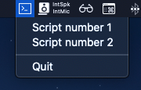

# BashTray

BashTray is a macOS desktop application for running bash script from system tray menu.

## Installation

Download is available [here](https://github.com/kunstefix/bash-tray/releases/tag/untagged-7a8482a1f99591a2925e).

## Usage
After running the application for the first time, the app will create a `bt-config.json` file in you home directory. Edit this file to configure tray menu. Restart app to refresh apply changed configuration.

Example file content:
```
[
  {
    "label": "Script number 1",
    "path": "/path/to/script1.sh"
  },
  {
    "label": "Script number 2",
    "path": "/path/to/script2.sh"
  }
]
```

Will result in:




## Contributing
Pull requests are welcome. For major changes, please open an issue first to discuss what you would like to change.
## License
[MIT](https://choosealicense.com/licenses/mit/)